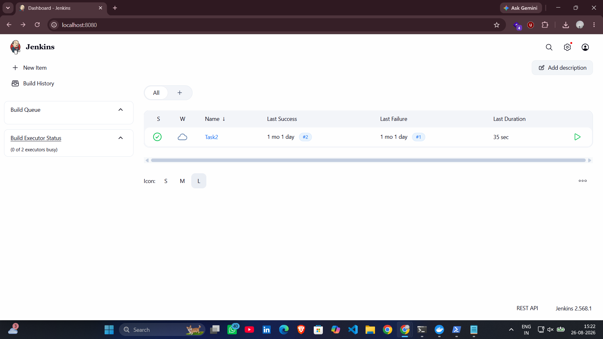
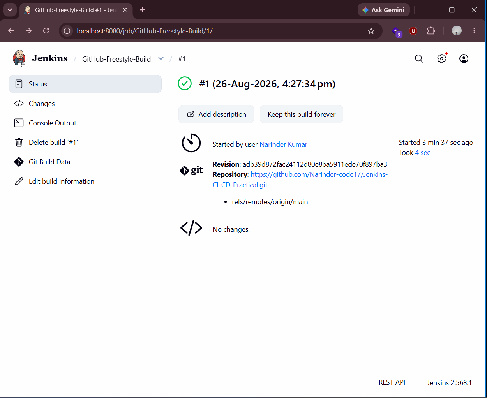
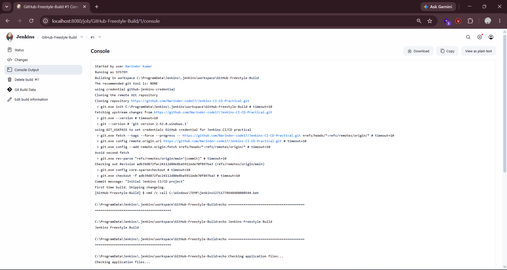
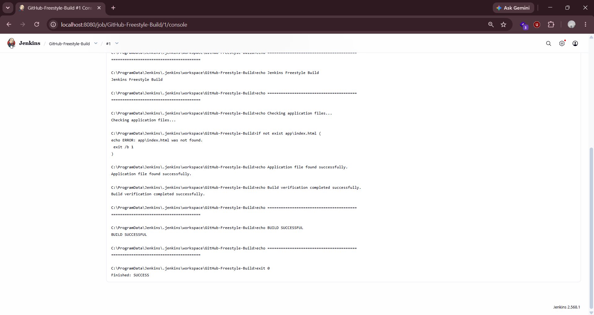
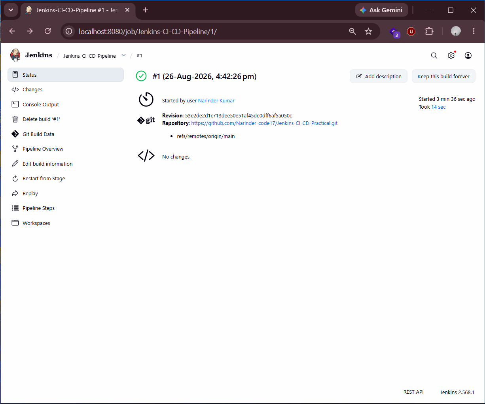
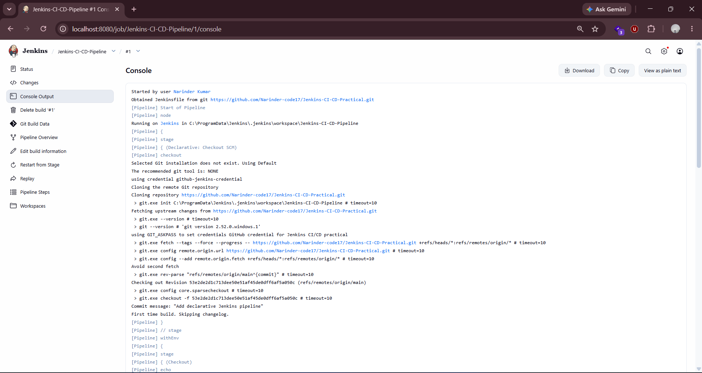
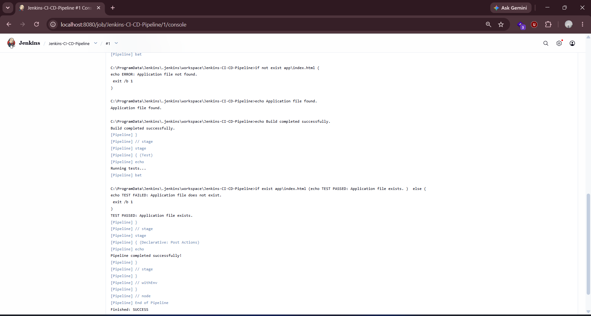
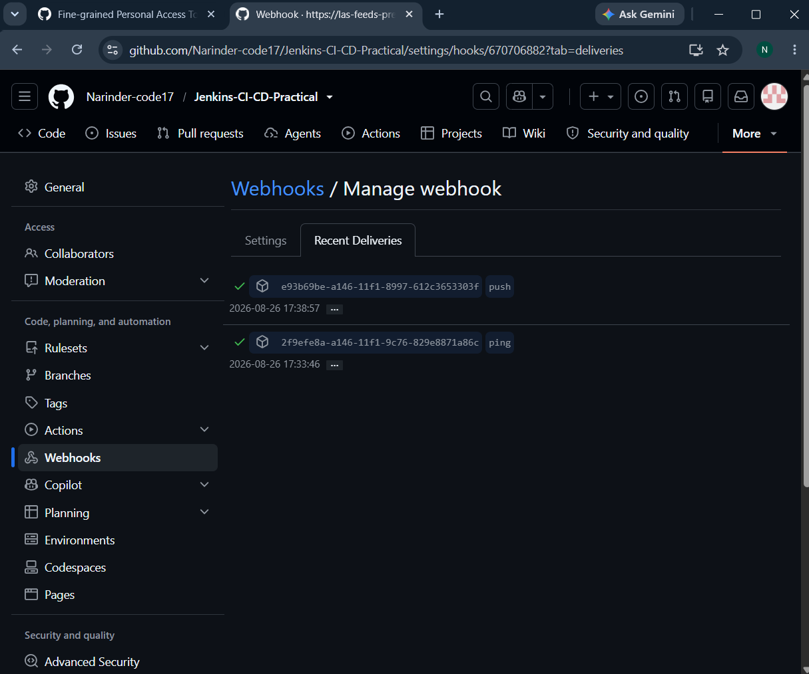
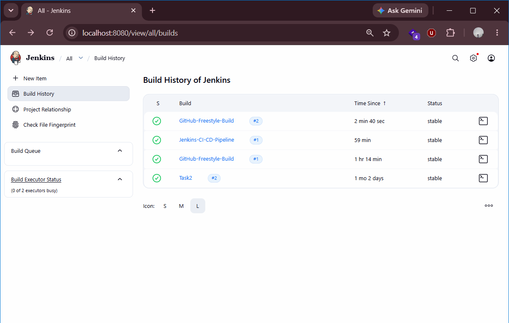
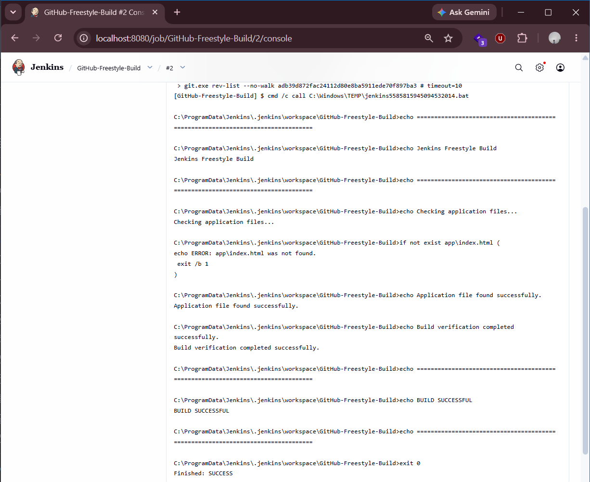

# Jenkins CI/CD Practical


## 📌 Project Overview

This project demonstrates a hands-on **Jenkins Continuous Integration and Continuous Deployment (CI/CD) practical** using GitHub as the source-code repository.

The practical covers GitHub integration with Jenkins, Freestyle projects, Declarative Jenkins Pipelines, Jenkinsfile-based automation, build execution, build logs, GitHub Webhooks, and automatic Jenkins build triggering.

The project also demonstrates how a code change pushed to GitHub can trigger Jenkins automatically through a GitHub Webhook.

---

## 🎯 Objectives

The main objectives of this practical are:

- Understand the fundamentals of Jenkins CI/CD.
- Integrate Jenkins with a GitHub repository.
- Create and execute a Jenkins Freestyle project.
- Create a Declarative Jenkins Pipeline.
- Use a `Jenkinsfile` to define pipeline stages as code.
- Configure GitHub Webhooks for automated build triggering.
- Verify successful Jenkins builds through console logs.
- Demonstrate an automated GitHub → Jenkins CI workflow.
- Maintain screenshots as evidence of the practical implementation.

---

## 🛠️ Technologies and Tools

| Technology / Tool | Purpose |
|---|---|
| **Jenkins** | CI/CD automation server |
| **GitHub** | Source code management and repository hosting |
| **Git** | Version control |
| **Jenkinsfile** | Pipeline-as-code configuration |
| **GitHub Webhooks** | Automatic Jenkins build triggering |
| **HTML** | Sample application |
| **VS Code** | Development and project management |
| **Cloudflare Tunnel** | Exposes local Jenkins server for GitHub Webhook communication |

---

## 🏗️ Project Architecture

```text
                    ┌─────────────────┐
                    │     Developer   │
                    │   Code Changes  │
                    └────────┬────────┘
                             │
                             ▼
                    ┌─────────────────┐
                    │     GitHub      │
                    │   Repository    │
                    └────────┬────────┘
                             │
                             │ GitHub Webhook
                             ▼
                    ┌─────────────────┐
                    │   Cloudflare    │
                    │     Tunnel      │
                    └────────┬────────┘
                             │
                             ▼
                    ┌─────────────────┐
                    │     Jenkins     │
                    │   CI/CD Server  │
                    └────────┬────────┘
                             │
                             ▼
                    ┌─────────────────┐
                    │  Build & Test   │
                    │    Pipeline     │
                    └────────┬────────┘
                             │
                             ▼
                    ┌─────────────────┐
                    │ Successful Build│
                    │     Result      │
                    └─────────────────┘
```

---

## 🔄 CI/CD Workflow

The implemented workflow is:

```text
Developer
    ↓
Git Commit
    ↓
Git Push
    ↓
GitHub Repository
    ↓
GitHub Webhook
    ↓
Cloudflare Tunnel
    ↓
Jenkins
    ↓
Pipeline Trigger
    ↓
Checkout Source Code
    ↓
Build
    ↓
Test
    ↓
Successful Build
```

---

# 🚀 Practical Implementation

## 1. GitHub Repository

The project source code is maintained in a GitHub repository.

Repository:

**Jenkins-CI-CD-Practical**

The repository contains:

```text
Jenkins-CI-CD-Practical/
│
├── README.md
├── Jenkinsfile
│
├── app/
│   └── index.html
│
└── screenshots/
    ├── 01-jenkins-dashboard.png
    ├── 04-freestyle-build-success.png
    ├── 05-build-logs.png
    ├── 05-build-logs1.png
    ├── 06-pipeline-execution.png
    ├── 07-pipeline-build-logs.png
    ├── 07-pipeline-build-logs1.png
    ├── 08_GitHub_Webhook_Success.png
    ├── 09_Jenkins_Automatic_Build.png
    └── 10_Webhook_Triggered_Build_Success.png
```

---

## 2. Jenkins Dashboard

Jenkins was configured and accessed locally through:

```text
http://localhost:8080
```

The Jenkins dashboard was used to manage and execute the CI/CD jobs.

### Jenkins Dashboard



---

# 3. Jenkins Freestyle Project

A Jenkins Freestyle project was created to demonstrate a basic CI build process.

The Freestyle project integrates with the GitHub repository and executes the configured build steps.

### Successful Freestyle Build



### Freestyle Build Logs





---

# 4. Declarative Jenkins Pipeline

A Declarative Jenkins Pipeline was created to automate the CI/CD workflow.

The pipeline is defined using a `Jenkinsfile`, which is stored in the root directory of the repository.

The pipeline demonstrates stages such as:

```text
Checkout
   ↓
Build
   ↓
Test
```

### Pipeline Execution



### Pipeline Build Logs





---

# 5. Jenkinsfile

The project uses a `Jenkinsfile` to define the Jenkins pipeline as code.

This approach provides several advantages:

- Pipeline configuration is version controlled.
- Pipeline changes can be tracked through Git.
- The CI/CD process becomes reproducible.
- Jenkins can automatically load the pipeline definition from the repository.

The `Jenkinsfile` is located at:

```text
Jenkins-CI-CD-Practical/Jenkinsfile
```

---

# 6. GitHub Webhook Integration

GitHub Webhooks were configured to notify Jenkins whenever changes are pushed to the repository.

The configured webhook endpoint follows the Jenkins GitHub webhook format:

```text
/github-webhook/
```

A Cloudflare Quick Tunnel was used to expose the locally running Jenkins server to GitHub.

The communication flow is:

```text
GitHub
   ↓
Webhook POST Request
   ↓
Cloudflare Tunnel
   ↓
localhost:8080
   ↓
Jenkins
```

---

## 7. Webhook Verification

The GitHub Webhook delivery was successfully tested.

A successful webhook request returned:

```text
Response: 200
```

This confirms that GitHub successfully delivered the push event to the Jenkins webhook endpoint.

### GitHub Webhook Success



---

# 8. Automatic Jenkins Build Trigger

After configuring the GitHub Webhook, a change was pushed to the repository.

GitHub generated a `push` event and sent it to Jenkins through the configured webhook.

The Jenkins job was automatically triggered after the GitHub push.

### Jenkins Automatic Build



### Webhook Triggered Build



---

# 🔐 CI/CD Automation Demonstration

The practical successfully demonstrates the following automated process:

```text
1. Modify application code
        ↓
2. Commit changes
        ↓
3. Push changes to GitHub
        ↓
4. GitHub generates a push event
        ↓
5. GitHub sends webhook request
        ↓
6. Cloudflare Tunnel forwards request
        ↓
7. Jenkins receives webhook
        ↓
8. Jenkins automatically starts the job
        ↓
9. Pipeline executes
        ↓
10. Build completes successfully
```

---

# 📂 Project Structure

```text
Jenkins-CI-CD-Practical/
│
├── README.md
│
├── Jenkinsfile
│
├── app/
│   └── index.html
│
└── screenshots/
    ├── 01-jenkins-dashboard.png
    ├── 04-freestyle-build-success.png
    ├── 05-build-logs.png
    ├── 05-build-logs1.png
    ├── 06-pipeline-execution.png
    ├── 07-pipeline-build-logs.png
    ├── 07-pipeline-build-logs1.png
    ├── 08_GitHub_Webhook_Success.png
    ├── 09_Jenkins_Automatic_Build.png
    └── 10_Webhook_Triggered_Build_Success.png
```

---

# 📊 Results

The practical successfully demonstrated:

| Feature | Result |
|---|---|
| Jenkins Dashboard | ✅ Completed |
| GitHub Integration | ✅ Completed |
| Freestyle Project | ✅ Successful |
| Build Execution | ✅ Successful |
| Build Logs | ✅ Verified |
| Declarative Pipeline | ✅ Successful |
| Jenkinsfile | ✅ Implemented |
| GitHub Webhook | ✅ Configured |
| Webhook Delivery | ✅ Successful |
| Automatic Jenkins Trigger | ✅ Verified |
| Screenshot Evidence | ✅ Added |

---

# 📚 Key Concepts Learned

Through this practical, the following DevOps concepts were implemented and understood:

### Continuous Integration

Continuous Integration allows developers to frequently integrate code changes into a shared repository and automatically build and test those changes.

### Continuous Deployment

Continuous Deployment extends the CI workflow by automating the process of delivering successfully validated changes to the target environment.

### Jenkins

Jenkins is an automation server commonly used to implement CI/CD pipelines.

### Jenkins Pipeline

A Jenkins Pipeline defines the stages and steps required to automate software delivery.

### Jenkinsfile

A Jenkinsfile stores the pipeline configuration as code inside the source-code repository.

### GitHub Webhook

A GitHub Webhook allows GitHub to notify an external service when repository events such as pushes occur.

### Pipeline as Code

Keeping the Jenkins pipeline in a `Jenkinsfile` allows the CI/CD configuration to be version controlled together with the application source code.

---

# 🎓 Learning Outcome

This practical provided hands-on experience with:

- Jenkins job creation
- Jenkins Freestyle projects
- Declarative Pipelines
- Jenkinsfile configuration
- Git and GitHub integration
- GitHub Webhooks
- Automated build triggering
- Build and pipeline monitoring
- Console log analysis
- Local Jenkins exposure using Cloudflare Tunnel
- CI/CD workflow implementation

---

# 👨‍💻 Author

**Narinder Kumar**

Computer Science & Engineering

Mangalore Institute of Technology and Engineering (MITE)

GitHub: [Narinder-code17](https://github.com/Narinder-code17)

---

# ⭐ Conclusion

This project demonstrates a complete hands-on Jenkins CI/CD workflow starting from source-code changes in GitHub and ending with an automatically triggered Jenkins build.

The integration of **GitHub, Jenkins, Jenkinsfile, GitHub Webhooks, and Cloudflare Tunnel** demonstrates how automated CI/CD workflows can reduce manual intervention and provide faster feedback on code changes.

The project successfully verifies both **manual Jenkins pipeline execution** and **automatic webhook-triggered builds**.